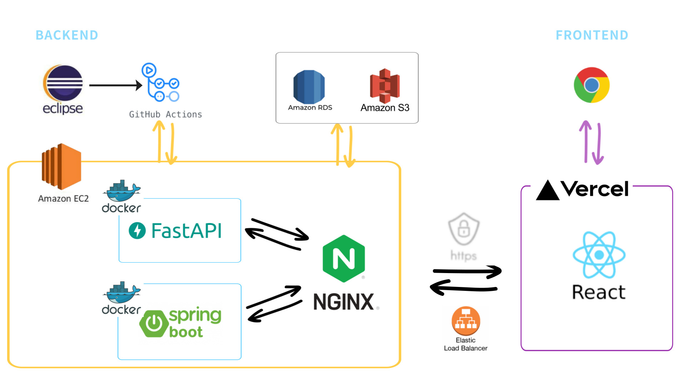

# Good-Influence_v3

## ⏰ 일정

- 2023/08/01 ~ 09/30 - v1 버전 (개발 완료 + 배포 완료)
- 2023/10/24 ~ 11/05 - v2 버전 (리팩토링)
- 2023/11/09 ~ 11/31 - v3 버전 (FastAPI 및 Devops 적용 ) 
  
<br>

## 📄 아키텍처 ( 예상 )  

<br>

<br>

## 📄 기술 스택

```
React, Axios, Recoil

Java 17, Spring Boot 2.7.13, Spring Data JPA,
Spring Security, JWT, OAuth2, validation

FastAPI

Nginx, Github Actions, Docker 


MySQL
```

<br>
